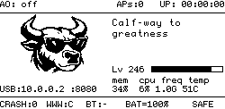

# Oxigotchi

> Pwnagotchi on steroids. AngryOxide + patched WiFi on Pi Zero 2W. No dongles needed.

---

## What Is This

A single ~5MB Rust binary that replaces the entire Python + bettercap + pwngrid stack. Boots to scanning in under 5 seconds, runs in ~10MB RAM. No Python, no venv, no Go runtime. An 8-layer firmware patch eliminates all WiFi crashes on the BCM43436B0 — the chip that stock pwnagotchi crashes on every 2-5 minutes. Six attack types, real-time RF classification, 26 bull faces. The pwnagotchi is a pet. The Oxigotchi is a workbull.

---

## The Numbers

| Metric | Stock Pwnagotchi | Oxigotchi v3.0 |
|--------|-----------------|----------------|
| WiFi crashes | Every 2-5 min | Zero (8-layer firmware patch, 27,982 frames tested) |
| Attack types | 2 | 6 (+ CSA, disassoc, anon reassoc, rogue M2) |
| Memory | ~80 MB | ~10 MB |
| Boot time | 2-3 min | <5 sec |
| RF awareness | None | 10 frame types, 256 frames/ms, live RF stats |
| Binary size | 150MB+ | ~5 MB |
| SD card lifespan | ~1-2 years | 10+ years |
| Language | Python + Go | 100% Rust |

---

## What We Built

**WiFi Firmware** — We reverse-engineered the BCM43436B0 firmware — mapped 6,965 functions, reconstructed 313 struct fields, traced 24,328 cross-references. Built an 8-layer patch including a DWT hardware watchpoint that intercepts ALL crash paths, even 5 callers in read-only ROM that no software patch can reach. Result: 27,982 injected frames in a 5-minute stress test, zero crashes. The firmware that died every 2 minutes now runs indefinitely. **[Full deep dive →](../../wiki/WiFi-Firmware)**

**GPU RF Classification Pipeline** — A dedicated pipeline taps raw 802.11 frames from wlan0mon via libpcap and classifies every frame in real time — Beacon, Probe, Deauth, Data, and 6 more types. We built a real VideoCore IV QPU kernel in hand-encoded machine code for the Pi's GPU, discovered through systematic hardware debugging that QPU conditional execution doesn't work via register poke, and ended up with a CPU classifier that's 41x faster (256 frames in ~1ms). The bull's mood now responds to the RF spectrum. **[Full deep dive →](../../wiki/RF-Classification-Pipeline)**

**Bluetooth Pentest Mode** — The BCM43436B0 shares a UART between WiFi and Bluetooth — they can't run simultaneously. Oxigotchi cleanly separates them: RAGE mode for WiFi attacks, SAFE mode for BT tethering to your phone. One button toggles between them. SAFE mode gives you internet for WPA-SEC uploads and Discord notifications. **[Details →](../../wiki/Bluetooth)**

**Self-Healing & Connectivity** — Stock pwnagotchi: SSH drops every time the firmware crashes, days of troubleshooting just to connect. Oxigotchi: USB lifeline at 10.0.0.2 that never goes down. PSM watchdog reset, crash loop detection, modprobe recovery, GPIO power cycle, graceful give-up. The daemon never reboots the Pi — SSH and the web dashboard stay accessible no matter what. **[Architecture →](../../wiki/Architecture)**

---

## Bull Faces — What They Mean

Every mood has its own bull. Here are 26 faces:

| Face | Name | What's Happening |
|---|---|---|
|  | **Awake** | System booting or starting a new epoch |
|  | **Scanning** | Sweeping channels, looking for targets |
|  | **Scanning (happy)** | Sweeping channels, good capture rate |
|  | **Intense** | Sending PMKID association frames |
|  | **Cool** | Sending deauthentication frames |
|  | **Happy** | Just captured a handshake |
|  | **Excited** | On a capture streak |
|  | **Smart** | Found optimal channel or processing logs |
|  | **Motivated** | High capture rate |
|  | **Sad** | Long dry spell, no captures |
|  | **Bored** | Nothing happening for a while |
|  | **Demotivated** | Low success rate |
|  | **Angry** | Very long inactivity or many failed attacks |
|  | **Lonely** | No other pwnagotchis nearby |
|  | **Grateful** | Active captures + good peer network |
|  | **Friend** | Met another pwnagotchi |
|  | **Sleep** | Idle between epochs |
|  | **Broken** | Crash recovery, forced restart |
|  | **Upload** | Sending captures to wpa-sec/wigle |
|  | **WiFi Down** | Monitor interface lost |
|  | **FW Crash** | WiFi firmware crashed, recovering |
|  | **AO Crashed** | AngryOxide process died, restarting |
|  | **Battery Low** | Battery below 20% |
|  | **Battery Critical** | Battery below 15%, shutdown soon |
|  | **Debug** | Debug mode active |
|  | **Shutdown** | Clean power off |

---

## Hardware You Need

> **This project is for the Raspberry Pi Zero 2W ONLY.**
>
> The firmware patches target the BCM43436B0 WiFi chip, which is specific to the Pi Zero 2W. **Other Pi models (Pi 3, Pi 4, Pi Zero W, Pi 5) have different WiFi chips and WILL NOT WORK.**

| Component | Required? | Notes |
|---|---|---|
| **Raspberry Pi Zero 2W** | **YES** | Must be the Zero **2** W (not the original Zero W). |
| **microSD card (16GB+)** | **YES** | Class 10 or faster. 32GB recommended. |
| **Micro USB cable** | **YES** | For power and data (USB tethering). |
| **Waveshare 2.13" V4 e-ink display** | Recommended | Shows the bull faces. The "V4" matters — other versions have different drivers. |
| **PiSugar 3 battery** | Optional | Makes it portable. Battery level shows on dashboard and triggers low-battery faces. |
| **3D-printed case** | Optional | Protects the stack. Many designs on Thingiverse. |

---

## Installation

### Flash the Image (Recommended)

1. **Download the Oxigotchi image** from the [Releases](../../releases) section.
2. **Flash it to your microSD card** using [Raspberry Pi Imager](https://www.raspberrypi.com/software/) or [balenaEtcher](https://etcher.balena.io/).
3. **Insert the SD card** into your Pi Zero 2W.
4. **Windows users: install the USB gadget driver** — Download and run [rpi-usb-gadget-driver-setup.exe](https://github.com/jayofelony/pwnagotchi/releases) before connecting. macOS and Linux don't need this.
5. **Connect the Pi** via the micro USB **data** port (the one closest to the center, not the edge).
6. **Power on.** Wait about 5 seconds for boot.
7. **That's it.** The bull appears on the e-ink display and AngryOxide begins scanning automatically in RAGE mode (the default).

> **Default credentials** (change these after first boot):
> - SSH: `pi` / `raspberry`
> - Web UI: `changeme` / `changeme`
>
> To SSH in: `ssh pi@10.0.0.2`

---

## Learn More

- **[WiFi Firmware Reverse Engineering](../../wiki/WiFi-Firmware)** — The 8-layer BCM43436B0 firmware patch that eliminated all WiFi crashes
- **[RF Classification Pipeline](../../wiki/RF-Classification-Pipeline)** — Real-time 802.11 frame classification via VideoCore IV GPU and CPU
- **[Bluetooth Pentest Mode](../../wiki/Bluetooth)** — RAGE/SAFE mode switching, UART multiplexing, BT tethering
- **[Capture Pipeline](../../wiki/Capture-Pipeline)** — tmpfs-based capture flow, hashcat conversion, SD card protection
- **[Web Dashboard](../../wiki/Web-Dashboard)** — 23 live cards, REST API, mobile-friendly control panel
- **[Architecture & Self-Healing](../../wiki/Architecture)** — Daemon design, epoch loop, crash recovery, module overview
- **[Building & Cross-Compilation](../../wiki/Building)** — Rust cross-compile for aarch64, Pi sysroot, deployment
- **[Troubleshooting & FAQ](../../wiki/Troubleshooting-and-FAQ)** — Common issues, apt safety, plugin authoring, XP system

---

## Maintenance & Support

This project is provided **as-is**. It's stable, tested (480+ unit tests, overnight soak test, 28,000-frame injection stress test), and production-ready.

**I will not be maintaining this project actively.** No issue tracking, no PR reviews. The code is GPL-3.0 — fork it, modify it, make it yours.

The pwnagotchi community is active and helpful: [Discord](https://discord.gg/pwnagotchi) · [Reddit](https://www.reddit.com/r/pwnagotchi/) · [Forums](https://community.pwnagotchi.ai/)

The bull will take care of itself.

## Support

If Oxigotchi has been useful to you and you'd like to support the work:

**BTC:** `bc1qnssffujsx5j2h7ep4wzyfa47azjlpwmaq8xtxk`

**ADA:** `addr1qymlyk49yaezevvm525ah6vey3sgah4clt83jmvcp60g5j25v6ukmh4628xn0hanrxwrae2j4huz3j36zt76ph40d44q703236`

No pressure — this project is free and always will be. But firmware reverse-engineering takes a lot of coffee.

## Credits

- [**Pwnagotchi**](https://pwnagotchi.ai) — The original WiFi audit pet by evilsocket and the pwnagotchi community
- [**AngryOxide**](https://github.com/Ragnt/AngryOxide) — Rust-based 802.11 attack engine by Ragnt
- [**Nexmon**](https://nexmon.org) — Firmware patching framework by the Secure Mobile Networking Lab
- [**wpa-sec**](https://wpa-sec.stanev.org) — Free distributed WPA handshake cracking service

## License

[GNU General Public License v3.0](LICENSE)

The WiFi firmware binary on the SD image is a patched version of Broadcom's BCM43436B0 firmware that ships with every Pi Zero 2W. No Broadcom source code is included in this repository.
